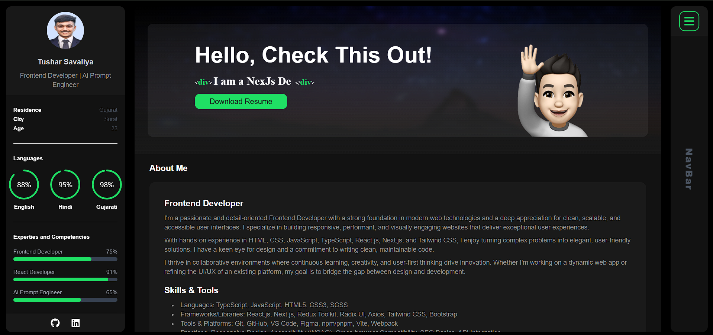

<div align="center">
  
  

  <br />
  <br />
  
  <!-- TODO: Replace with your own logo or a relevant project image -->
  

  <h2 align="center">Tushar Savaliya - Personal Portfolio</h2>

This website is a fully responsive personal portfolio, <br /> showcasing my projects and skills. <br /> Built with Next.js and Tailwind CSS.

<a href="https://my-portfolio-six-liart-57.vercel.app/"><strong>➥ Live Demo</strong></a>

</div>

<br />

### Key Features

- **Responsive Design:** Adapts to all device sizes (desktops, tablets, mobiles).
- **Project Showcase:** Displays completed and open-source projects.
- **Interactive Elements:** Smooth scrolling, animations, and a functional contact form.
- **Typewriter Effect:** Engaging text animation on the banner.
- **Contact Form:** Integrated with Formspree for easy communication.

### Demo Screenshot



### Technologies Used

- **Frontend:** Next.js, React, Tailwind CSS
- **UI Components:** Ant Design (for Modals)
- **Form Handling:** Formspree
- **Icons:** React Icons

### Folder Structure

A brief overview of the project's main directories:

```
My-Portfolio/
├── components/       # Reusable React components (e.g., Banner, Footer, Modals)
│   ├── Common/       # Components shared across multiple pages/sections
│   └── HomeComponents/ # Components specific to the Home page
├── constants/        # Constant values and configurations
├── pages/            # Next.js pages, representing routes in the application
│   ├── api/          # API routes (if any)
│   └── _app.js       # Custom App component for Next.js
├── public/           # Static assets (images, fonts, favicon)
│   ├── images/
│   └── readme-images/
├── styles/           # Global styles and Tailwind CSS configuration
└── utils/            # Utility functions and helpers
```

### Prerequisites

Before you begin, ensure you have met the following requirements:

- [Git](https://git-scm.com/downloads "Download Git") must be installed on your operating system.
- [Node.js](https://nodejs.org/en/download/) (which includes npm) must be installed.

### Run Locally

To run this portfolio locally, follow these steps:

1.  Clone the repository:
    ```bash
    git clone https://github.com/TusharSavaliya987/My-Portfolio.git
    ```
2.  Navigate to the project directory:
    ```bash
    cd My-Portfolio
    ```
3.  Install dependencies:
    ```bash
    npm install
    ```
4.  Run the development server:
    ```bash
    npm run dev
    ```
    Open [http://localhost:3000](http://localhost:3000) with your browser to see the result.
